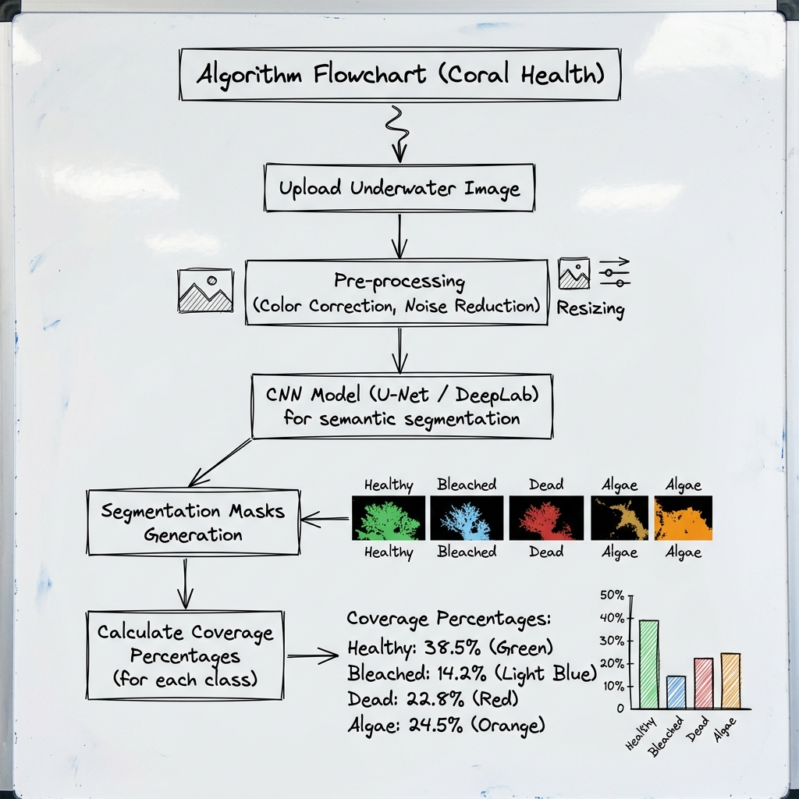

  <h1>🌊 CoralAI: Deep Learning Framework for Coral Reef Health Mapping</h1>
  
<strong>An AI-powered system that detects, segments, classifies, and maps coral reef health from underwater images and drone footage.</strong>

  
  <h3>🌍 Live Demo Links:</h3>
  

    <strong>User Portal:</strong> <a href="https://coral-reef-frontend.vercel.app/login">coral-reef-frontend.vercel.app/login</a> 
    <strong>Admin Portal:</strong> <a href="https://coral-reef-frontend.vercel.app/admin/login">coral-reef-frontend.vercel.app/admin/login</a>
  

 

  

 

## 🚀 Overview
CoralAI utilizes a comprehensive **Vision-Based Deep Learning Framework** to analyze coral health and address the limitations of manual annotation. Our system bridges the gap between raw underwater visual data and actionable ecological insights. 
By employing a decoupled architecture with a modern frontend and high-performance ML backend, CoralAI delivers real-time processing, stunning visualizations, and comprehensive reporting.

 

  

 

## 🎯 Key Features & Capabilities

- **Real-Time Image Processing:** Upload underwater footage and receive instantaneous health analysis.
- **Detailed PDF Reporting:** Generates downloadable reports summarizing reef health, area coverage, and anomaly detection.
- **Automated Color Correction:** Enhances underwater imagery before analysis, mitigating distortion caused by water depth and lighting.
- **Geospatial Mapping:** Interactive map visualization (via Leaflet) of analyzed reef locations.

 

## 🧠 Algorithms & Machine Learning Pipeline

CoralAI is powered by a robust and specialized AI pipeline:
- **YOLO (You Only Look Once):** Deployed for rapid object detection, identifying corals, rocks, sand, and other underwater elements with high precision.
- **U-Net & DeepLabV3+:** State-of-the-art semantic segmentation architectures utilized to classify individual pixels. This provides precise area coverage percentages for:
  - 🟢 **Healthy Coral**
  - 🟡 **Bleached Coral**
  - 🔴 **Dead Coral**
  - 🟤 **Algae**

 

  

 

## 🛠️ Tools & Technologies Used

The project is built on a modern, scalable technology stack:

- **Frontend:** 
  - **React (Vite)** with an attractive Glassmorphism UI
  - **Context API** for efficient state management
  - **Leaflet** for interactive geospatial mapping
- **Backend:** 
  - **FastAPI (Python)** for asynchronous, high-performance REST APIs
  - **Uvicorn** for ASGI server hosting
- **Machine Learning:**
  - **PyTorch / TensorFlow**
  - **YOLOv8** (Object Detection)
  - **U-Net / DeepLabV3+** (Semantic Segmentation)
- **Database & Authentication:** 
  - **Firebase Authentication**
  - **Firestore (NoSQL)**

 

## 🔐 Security & Role-Based Access Control (RBAC)

Security is deeply integrated into CoralAI to ensure data integrity and privacy:
- **Role-Based Access Control (RBAC):** Distinct access levels for Standard Users and Administrators.
- **Admin Portal:** Authorized personnel can manage datasets, view global statistics, and monitor system health.
- **Firestore Security Rules:** Strict rules are implemented to prevent unauthorized access or modification of the underlying database.

 

## 🔮 Future Scope
- **Multi-spectral Satellite Integration** (Sentinel-2) for macro-level mapping.
- **Temporal Bleaching Trend Prediction** using LSTM networks.
- **Edge Deployment** on NVIDIA Jetson for real-time field use.
- **3D Reef Reconstruction** from stereo video footage.

 

## 📄 License
MIT License

 

  
<i>Developed with ❤️ by Shiv</i>

