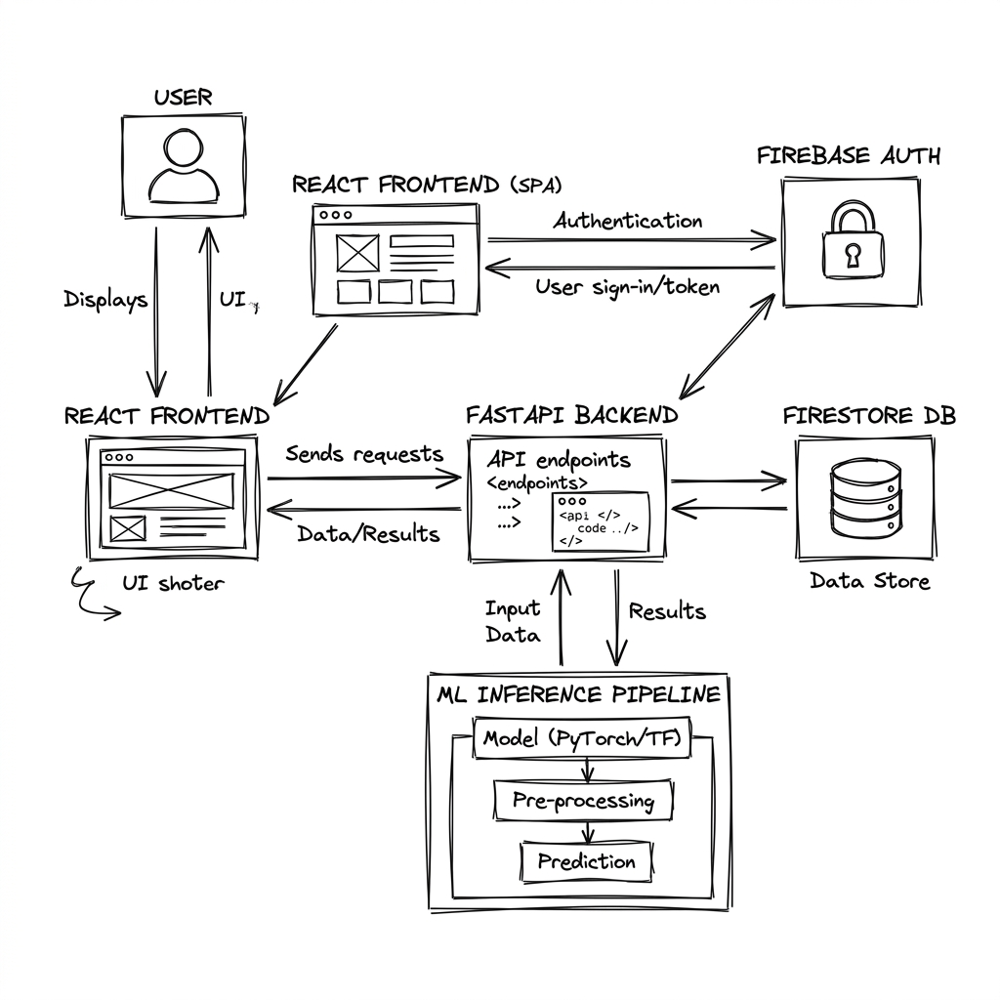

<div align="center">
  <h1>🌊 CoralAI: Deep Learning Framework for Coral Reef Health Mapping</h1>
  <p><strong>An AI-powered system that detects, segments, classifies, and maps coral reef health from underwater images and drone footage.</strong></p>
  
  <h3>🌍 Live Demo Links:</h3>
  <p>
    <strong>User Portal:</strong> <a href="https://coral-reef-frontend.vercel.app/login">coral-reef-frontend.vercel.app/login</a><br/>
    <strong>Admin Portal:</strong> <a href="https://coral-reef-frontend.vercel.app/admin/login">coral-reef-frontend.vercel.app/admin/login</a>
  </p>
</div>

<br />

<div align="center">
  
</div>

<br />

## 🚀 Overview
CoralAI utilizes a comprehensive **Vision-Based Deep Learning Framework** to analyze coral health and address the limitations of manual annotation.
- **Semantic Segmentation:** Deploys state-of-the-art architectures (U-Net and DeepLabV3+) to classify individual pixels, providing precise area coverage percentages for Healthy Coral, Bleached Coral, Dead Coral, and Algae.
- **End-to-End Pipeline:** From an intuitive React frontend to a high-performance FastAPI backend, users can seamlessly upload images, view real-time processing, and generate detailed PDF reports.
- **Automated Pre-processing:** Utilizes computer vision techniques to automatically correct underwater color distortion, significantly improving model accuracy.

<br />

## 🛠️ Architecture 

The system is built on a modern, decoupled technology stack:
- **Frontend:** React (Vite) featuring a glassmorphism UI, Context API for state management, and Leaflet for geospatial mapping.
- **Backend:** FastAPI (Python) for asynchronous, high-performance REST APIs.
- **Database & Auth:** Firebase Authentication and Firestore secured tightly with Role-Based Access Control (RBAC).
- **ML Pipeline:** Optimized models for rapid inference and background processing.

<br />

## ⚡ Quick Start

### 1. Environment Setup
```bash
# Copy and configure environment variables
cp .env.production.example .env.production
```

### 2. Backend Setup
```bash
cd backend
pip install -r requirements.txt
uvicorn app.main:app --host 0.0.0.0 --port 8000
```

### 3. Frontend Setup
```bash
cd frontend
npm install
npm run dev
```

<br />

## 🔐 Firebase Setup
1. Create a Firebase project at [console.firebase.google.com](https://console.firebase.google.com).
2. Enable **Authentication** (Email/Password) and **Firestore**.
3. Generate a service account JSON and save it as `backend/firebase-service-account.json`.
4. Deploy security rules: `firebase deploy --only firestore:rules`
5. Update environment variables with your Web App config.

<br />

## 🔮 Future Scope
- **Multi-spectral satellite integration** (Sentinel-2) for macro-level mapping.
- **Temporal bleaching trend prediction** using LSTM networks.
- **Edge deployment** on NVIDIA Jetson for real-time field use.
- **3D reef reconstruction** from stereo video footage.

<br />

## 📄 License
MIT License
